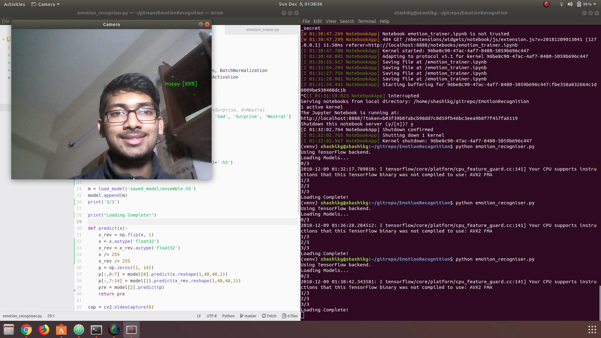

# Real Time Human Emotion Recognition
This repo contains files related to my project on emotion recognition carried during the end of my 5th semester as a hobby project. Presently, its capable of extracting faces from a web cam stream and classify them into 7 different moods i.e. Angry, Disgust, Fear, Happy, Sad, Surprise and Neutral. The face detection module uses already trained Haar-Cascade Classifier from OpenCV. And Classifier was trained on the **ICML 2013** dataset of [Facial Expression Recognition Challenge](https://www.kaggle.com/c/challenges-in-representation-learning-facial-expression-recognition-challenge) on kaggle.



**Link to Demo Video:** [https://youtu.be/XVQSMbeBGZQ](https://youtu.be/XVQSMbeBGZQ)

## Training Results
**Accuracy Achieved on Test Data:** 65.34 %
**Confusion Matrix:**


## Usage
Install all the dependencies in a virtual environment
```
$ virtualenv --system-site-packages -p python3 ./venv
$ source ./venv/bin/activate
$ pip install -r requirements.txt
```
Then run the following commands to test the module
```
# To train the a new model
$ python emotion_trainer.py

# To run the emotion recognition module
$ python emotion_recogniser.py
```

## Directory Structure
```
├── saved_model
│   └── cnn0.h5 ..................................:: Trained CNN model
│   └── cnn1.h5 ..................................:: Trained CNN model on mirror images
│   └── ensemble.h5 ..............................:: Trained NN Model on prediction from above two
│   └── haarcascade_frontalface_default.xml ......:: OpenCV Haar-Cascade model for frontfaces
├── detectfaces.py ...............................:: Contains function to call haar cascade classifier and
│                                                    crop & resize the detected faces to 48x48 size
├── emotion_trainer(.py/ .ipynb) .................:: This will train the designed Neural Network model on the given dataset
├── emotion_recogniser.py ........................:: This is the main program which will show real-time emotion classification
│                                                    using the models saved in the directory 'saved_model/'
├── test.jpeg
├── requirements.txt
└── README.md
```
